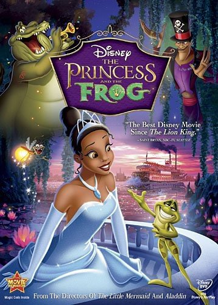

<!DOCTYPE html>
<html>
  <title>Hadeswerk</title>
<head>
 <link href="https://fonts.googleapis.com/css?family=Oxygen&display=swap" rel="stylesheet">
 <h1 style="text-align:center; color:grey ; font-family: 'Oxygen'; font-size:40px">Content Needed to be Added to Plex </h1>
 <link rel="shortcut icon" type="image/x-icon" href="favicon.ico">
 
</head>

<body>

<strong style="font-family:Oxygen;text-align:center; color:grey;font-size:30px">Anime</strong>

<ul style="font-family:Oxygen;color:grey;font-size:25px">

  <li>KonoSuba</li>
  <li>Demon Slayer</li>
  <li>My Hero Academia</li>
  <li>Naruto</li>
</ul>
</body>

    

        
    

    

        
    

    

        
    

    

        
    

 
 

<body> 
<strong style="font-family:Oxygen;color:grey;font-size:30px"> Movies </strong>

<ul style="font-family:Oxygen; color:grey;font-size:25px">

  <li>Cinderella</li>
  <li>The Princess and the Frog</li>
  <li>Hercules</li>
  <li>The Hunchback of Notre Dame</li>
</ul>
</body>

    

        
    

    

        
    

    

        
    

    

        
    

 
 

<body> 
<strong style="font-family:Oxygen;color:grey;font-size:30px"> TV Shows </strong>

<ul style="font-family:Oxygen;color:grey;font-size:25px">

  <li>Codename: Kids Next Door</li>
  <li>Bob's Burgers</li>
  <li>Regular Show</li>
  <li>Locke & Key</li>
</ul>
</body>

    

        
    

    

        
    

    

        
    

    

        
    

 
 

 <h2 style="text-align:center; color:grey ; font-family: 'Oxygen'; font-size:30px"> Links </h2>

<body>

<a href="https://github.com/HadesTest">GitHub</a>
 

<a href="https://discordapp.com/">Discord</a>
 

<a href="">Website</a>
 

<a href="About.html">About Page</a>    

</body>

<footer style="font-family:Oxygen;text-align:center;color: grey;">Copyright &copy; All rights reserved | This website was made by Hades </footer>

</html>
